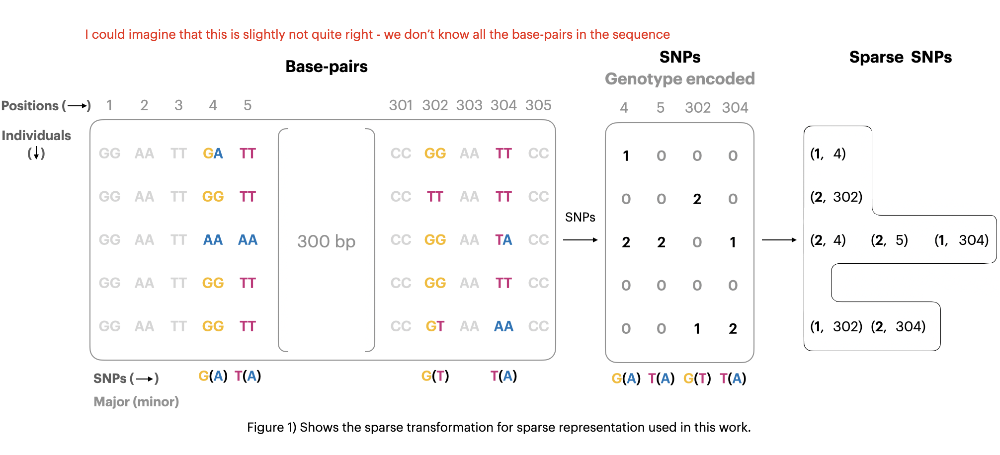
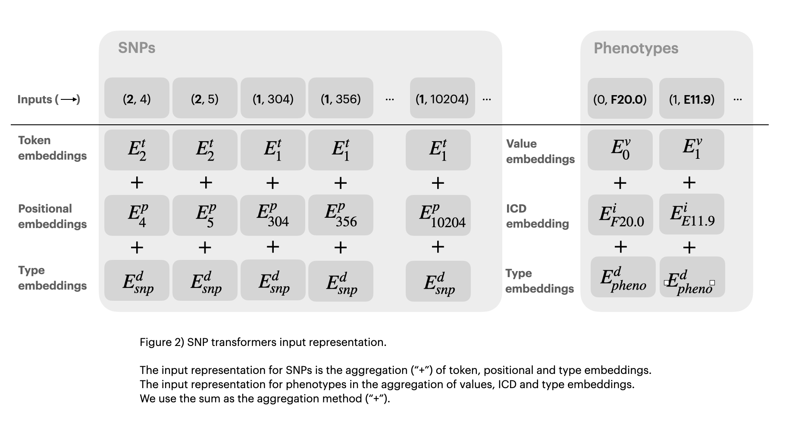

# SNP Transformer: Sparse SNP-based prediction for complex traits using only variants

# Abstract

# Introduction

Multiple softwares [multiblup, blup] seeks to represent the genetic predisposition of an individual using a polygenic risk score (PRS) from a set of genetic variants. However, these methods are limited by their requirement of large sample sizes and their inability to capture the complexity of the genetic predisposition. Recent work in language and vision processing have shown that semantic embedding of text sequences or image segments can obtain non-trivial few-shot performance, where a model pre-trained on a large corpus, can be further trained on a small dataset to obtain good performance. This is promising for genetic predisposition, as it allows for a model to be trained on a large dataset and then fine-tuned on a small dataset. However, these models are notably limited by their sequence length. Recent developments such as HyenaDNA [cite], RWKV [cite] and mamba [cite] have sought to improve the complexity to long genetic sequences better - however, they are still limited to sequence lengths of up to million length nucleotide sequences. These models are notably intended for tasks such as regulatory element classification or chromatin profiling which does not require whole genome context. However, the genetic predisposition of an individual is a whole genome context problem. 

In this work we propose a sparse transformer model that can represent the genetic predisposition of an individual using only minor alleles. In classical GWAS it is common to use SNPs as a proxy for the genetic predisposition of an individual, where you don't represent the whole genome, but only the SNPs. However these classical methods require a consistent input length and this the individual x SNP matrix is often sparsely populated (majority of SNP is only a variant for a small subset of the population). This has limited classical methods to mainly linear model and although deep learning approaches exist [Arnor's paper](https://academic.oup.com/nar/article/51/12/e67/7177885?login=true), they utilize classical methods for SNP selection to select the most promising SNPs.  

This work utilizes the Transformers archicecture [attention is all you need, bert] which are able to handle variable length sequences using an attention mechanism operating like a set transformation [geometric deep learning], where positional information is supplied using a positional embedding. 

We show that This allows for the model to only represent the variants that are relevant for the given individual, and thus remove the sparse input problem. This reduction allow for more complex modelling and thus a more complex representation of the genetic predisposition. For example, exome data contains approximately 20M SNPs, and so conventional methods would have to deal with matrices containing n x 20M elements, where n is the number of individuals. By contrast, a sparse encoding considers only elements with non-zero value. As the average frequence of exome SNPs is less than 5%, sparse encodes need only consider ragged matrices with fewer than n x 1M elements.

<!-- 
- Multiple application seeks to represent the genetic predisposition of an individual 
- It is common to construct a polygenic risk score (PRS) from a set of genetic variants
  - A single value that represents the genetic predisposition of an individual
  - The PRS is constructed by summing the effect sizes of the variants weighted by the number of alleles
  - Problems: 
    - A single value does not capture the complexity of the genetic predisposition and does not allow for environmental interactions (i.e. a mean represent a bimoal distribution poorly)
    - It handles one disease at a time, 
      - even though some diseases are correlated and might provide and the predispisition of one disease might be correlated with the predisposition of another disease 
      - similarly they require large sample sizes, which for some diseases are not available and might never be available
- Promising Solution (learned vector representations):
  - Recent work NLP and vision processign have shown that semantic embedding of text sequences or image segment can obtain non-trivial few-shot performance, where a model pre-trained on a large corpus, can be further trained on a small dataset to obtain good performance
  - This is promising for genetic predisposition, as it allows for a model to be trained on a large dataset and then fine-tuned on a small dataset
  - Problems: These models are notably limited by their sequence length
    - Recent developments such as HyenaDNA have saught to improve the complexity to long genetic sequences better - however, they are still limited to sequence lengths of up to 1M nucleotides
    - scaling to long context is a ongoing problems in the field (longformer, retentive transformer, RWKW)
    - These models are notably intended for tasks such as regulatory element classification or chromatin profiling which does not require whole genome context
    - However, the genetic predisposition of an individual is a whole genome context problem 
- Our Solution:
  - We propose a transformer model that can represent the genetic predisposition of an individual using only minor alleles
    - In classical GWAS it is common to use SNPs as a proxy for the genetic predisposition of an individual, where you don't represent the whole genome, but only the SNPs
    - However these classical methods require a consistent input length and this the individual x SNP matrix is often sparsely populated (majority of SNP is only a variant for a small subset of the population)
    - This has limited classical methods to mainly linear model (although deep learning approaches exist (Arnor's paper))
    - Transformers are able to handle variable length input and thus can remove the sparse input problem by only representing the variants that are relevant for the given individual
    - This reduction allow for more complex modelling and thus a more complex representation of the genetic predisposition
  - For example, exome data contains approximately 20M SNPs, and so conventional methods would have to deal with matrices containing n x 20M elements, where n is the number of individuals. By contrast, a sparse encoding considers only elements with non-zero value. As the average frequence of exome SNPs is less than 5%, sparse encodes need only consider matrices with fewer than n x 1M elements. -->

## Overview of the field

https://www.sciencedirect.com/science/article/abs/pii/S1568494620306566:

- Outlines the curse of dimensionality of as one the main challenges of using ML on SNPs for phenotype prediction
- unequal sample sizes
- 

# Methods

## Model Architecture
For our model architecture we utilize the standard encoder. While more modern alternatives exists, such as the longformer [cite], this works generally examines the plaisabilty of using sparse encoding for SNP-based prediction.

The model architecture is as follows:

**Input Encoding**: The input SNPs is encoded using a sparse encoding of the minor alleles. This is done by creating a ragged tensor (see figure 1) where each row represents the minor alleles of a given individual. The ragged tensor is then converted to dense embeddings using an embedding layer, $f_{t}: \mathbb{N}^{n \times m} \to \mathbb{R}^{n \times m \times d}$, where $n$ is the number of individuals, $m$ is the number of SNPs and $d$ is the dimension of the embedding. We additionally enrich the embeddings using positional embedding $f_p: \mathbb{N}^{m} \to \mathbb{R}^{m \times d}$, where $m$ is the number of SNPs and $d$ is the dimension of the embedding. The positional embedding is added to the dense embeddings to obtain a singular embedding (see figure 2). 

We additionally add the phenotypes encodings to the embeddings using a dense layer $f_{v,i}: \mathbb{N}^{n\times p} \to \mathbb{R}^{n \times p \times d}$, where $n$ is the number of individuals, $p$ is the number of phenotypes and $d$ is the dimension of the embedding. The phenotypes are then added to the embeddings obtaining a $\mathbb{R}^{n \times m+p \times d}$ tensor. To allow the model to differentiate between phenotypes and SNP additionally add a domain type ($f_d$) embedding (see figure 2).

Note that we additionally allow the values of phenotypes and SNPs to be unknown (denotes using [MASK]) and the model is trained to predict the values of the masked elements. 

**Encoder**: The embeddings are then passed through the transformer encoder. The transformer encoder is a stack of $N$ identical layers. Each layer has two sub-layers. The first is a multi-head self-attention mechanism, and the second is a simple, position-wise fully connected feed-forward network. We utilize the standard transformer encoder as described in [attention is all you need], but will briefly describe the two sub-layers.

**Multi-head Attention**: The attention mechanism is a mechanism that allows the model to weigh the importance of each element in the input sequence. It consist of three transformations of the input using the weight matrices $W_i^Q, W_i^K, W_i^V$ to obtain the query, key and value. The attention mechanism is as follows:

$$
\text{Attention}(Q, K, V) = \text{softmax}\left(\frac{QK^T}{\sqrt{d_k}}\right)V
$$

where $Q, K, V \in \mathbb{R}^{n \times m+p \times d}$ where e.g. $Q$ is obtained using $Q = E_iW^Q$, where $E_i$ is the embedding of the $i$-th input. $d_k$ is the dimension of the key.

in practice this approach the attention is reapeted $h$ times and the results are concatenated and multiplied by a weight matrix $W^O$ to obtain the output of the attention mechanism.

**Feed-forward network**: The feed-forward network is a simple fully connected network that applies a linear transformation followed by a non-linear activation function (e.g. ReLU). The feed-forward network is as follows:

$$
\text{FFN}(x) = \text{ReLU}(xW_1 + b_1)W_2 + b_2
$$

where $W_1, W_2 \in \mathbb{R}^{d \times d}$ and $b_1, b_2 \in \mathbb{R}^{d}$.

**Output**: The output of the transformer encoder is then passed through a linear layer to obtain the predicted values of the masked elements.

## Absolute vs relative positional Encodings

While the original transformer [vaswani_2017] model utilizes absolute positional encodings, multiple works
have since found relative positional encodings [alibi, rotary_embeddings] to be better for language modelling as the encoding of a word is relative to the encoding of the context. This is however not the case for our sparse encoding of base-pairs, which require absolute positional encoding to denote the global position of the SNP. 

The positional encoding is as follows:

$$
\text{PE}(pos, 2i) = \sin\left(\frac{pos}{10000^{2i/d}}\right)
$$

$$
\text{PE}(pos, 2i+1) = \cos\left(\frac{pos}{10000^{2i/d}}\right)
$$

where $pos$ is the position and $i$ is the dimension of the embedding.

## Dataset
[some introduction of the dataset]

# Results

## Performance comparison to classical models
Here we compare the performance of our model to classical models (such as multiblup and blup?). 

## Multi-task
[some results on multitask]

# Discussion

# Conclusion

# References

# Acknowledgements

